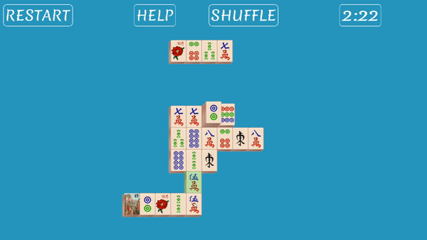
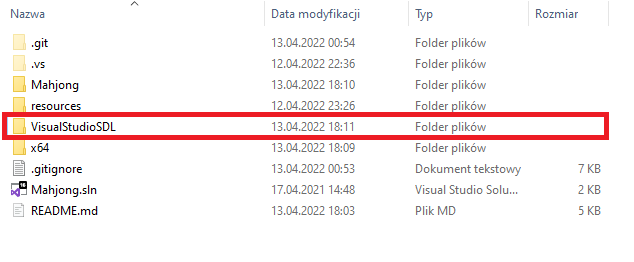
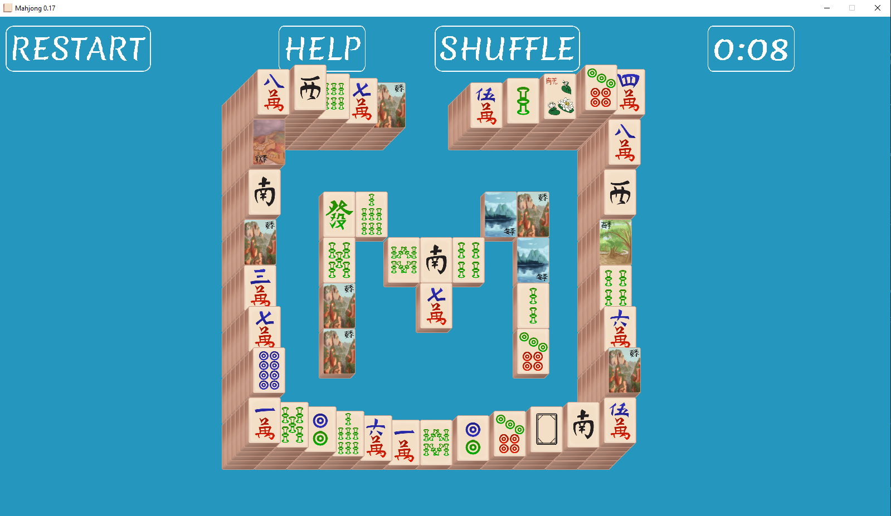

# 1. **Mahjong Solitaire**
To gra polegająca na znajdowaniu par jednakowych płytek i usuwaniu ich z planszy według ściśle określonych reguł. Płytki można usunać tylko wtedy, gdy nie są one zablokowane, to znaczy, że plytka nie jest przykryta inną lub nie sąsiaduje z lewej i prawej strony z innymi. Rozgrywka kończy się wtedy, gdy usuniemy wszystkie pary z planszy. 



---

 ## **Uruchamianie projektu**
W celu uruchomienia projektu niezbędne będzie skorzystanie z biblioteki SDL2. Pod tym [linkiem](https://drive.google.com/drive/folders/1Sw3VdbnQzKEaawAaY_xsUX6tB6j68zXX?usp=sharing) znajduje się wersja SDL2 wykorzystana w projekcie (Aktualnie dla kompilacji x64 projekt wyszukuje bibliotek w folderze solucji). Po jej pobraniu należy zadbać wrzucenie całego Folderu 'VisualStudioSDL' do folderu solucji tak jak na poniższym obrazku.



Drugą opcją jest ściągnięce folderu i umieszczenie go w miejscu gdzie Visual Studio wyszukuje standardowo biblioteki i pliki nagłówkowe. Wtedy należy zmienić w plikach sposób wskazywania plików nagłówkowych dla preprocesora z `"nazwa_pliku.h"` na `<nazwa_pliku.h>`.

# 2. **Ustawienia**
W celu zmiany ustawień w aktualnej wersji programu, należy odszukać plik 'config.txt'. Za pomocą słów kluczowych i wartości liczbowych zmieniamy wartości ustawień.

### `PRZYKŁAD`:
```
FULLSCREEN 1		 <- ustawia pełny ekran
SCREEN_WIDTH 1600	 <- ustawia szerokość okna na 1600 pikseli
SCREEN_HEIGHT 900	 <- ustawia wysokość okna na 900 pikseli
```

# 3. **Modyfikowanie**
Program umożliwia modyfikowanie warstwy video poprzez podmiane tekstur i czcionki. Można to zrobić na 2 sposoby. Pierwszy polega na dosłownym podmienieniu poszczególnych plikow. Zachowując te same nazwy plików. Drugim sposobem jest modyfikowanie ścieżek w plikach: **`textures_paths.txt`** oraz **`font_path.txt.`** Za pomoca komend oznaczajacych odpowiednie tekstury mozemy wskazywac cale sciezki do szukanego pliku.

### `PRZYKŁAD`:
```
BAMBOO_THREE Inne_tekstury/bamboo_3.png	 <- ustawienie ścieżki dla tekstury BAMBOO_THREE
FONT C:/Inne_czcionki/Merienda-Regular.ttf	 <- ustawia ścieżke do alternatywnej czcionki
```

# 4. **Spis komend**
W przypadku gdy pliki w folderze **`'data'`** zostaną źle nadpisane możesz skorzystac z poniższej listy komend zawierajacej wszystkie niezbędne słowa kluczowe dla poszczególnych plikow. W razie skasowania zawartosci pliku **`'readme.txt'`** wystarczy usunąć go trwale. Program w takim wypadku wykryje brak pliku i stworzy go na nowo.

### Lista komend:
1) **dla pliku 'textures_paths.txt'**
* SIGN_RED_ONE,
* SIGN_RED_TWO,
* SIGN_RED_THREE,
* SIGN_RED_FOUR,
* SIGN_RED_FIVE,
* SIGN_GREEN,
* SIGN_GOLD_ONE,
* SIGN_GOLD_TWO,
* SIGN_GOLD_THREE,
* SIGN_GOLD_FOUR,
* SIGN_BLACK_ONE,
* SIGN_BLACK_TWO,
* SIGN_BLACK_THREE,
* SIGN_BLACK_FOUR,
* SIGN_RECTANGLE,
* SIGNS_ONE,
* SIGNS_TWO,
* SIGNS_THREE,
* SIGNS_FOUR,
* SIGNS_FIVE,
* SIGNS_SIX,
* SIGNS_SEVEN,
* SIGNS_EIGHT,
* SIGNS_NINE,
* DOTS_ONE,
* DOTS_TWO,
* DOTS_THREE,
* DOTS_FOUR,
* DOTS_FIVE,
* DOTS_SIX,
* DOTS_SEVEN,
* DOTS_EIGHT,
* DOTS_NINE,
* BAMBOO_ONE,
* BAMBOO_TWO,
* BAMBOO_THREE,
* BAMBOO_FOUR,
* BAMBOO_FIVE,
* BAMBOO_SIX,
* BAMBOO_SEVEN,
* BAMBOO_EIGHT,
* BAMBOO_NINE,
* DEFAULT,
* SELECTED,
* HELP.

2) **dla pliku 'icon_path.txt'**
* ICON

3) **dla pliku 'font_path.txt'**
* FONT

4) **dla pliku 'pattern_path.txt'**
* PATTERN

# 5. Przykładowy wzór dla planszy:
Program umożliwia wstawianie dowolnej planszy do gry przez użytkownika. 

### `PRZYKŁAD`:
```
W 12
H 8
PATTERN
897650056798
700000000007
600110001106
500101110105
500100100105
600100000106
700000000007
654321123456
```
### `REZULTAT`:


---

# 6. Elementy wykonane/niewykonane:
* [X] wczytywanie różnych kształtów plansz
* [X] mechanizm osiągnięć oparty na wzorcu obserwator
* [X] dokumentowanie statystyk, które generowane są do plików .CSV
* [X] umożliwienie łatwej podmiany plików graficznych, dzięki czemu szatę wizualną można dostosować samemu
* [X] odwzorowanie pełnej mechaniki [Mahjong Solitaire](https://www.kurnik.pl/mahjong/) na której się wzorowałem
* [ ] interaktywne menu graficzne
* [ ] generowanie różnych serii permutacji danej planszy tak, aby 2 graczy na różnych komputerach mogło zmierzyć się ze sobą w takich samych konfiguracjach
* [ ] dostosowanie projektu pod inne platformy systemowe (Linux, macOS)

# 7. Źródła wykorzystywane w projekcie:
* [SDL2](https://www.libsdl.org/download-2.0.php)
* [Mahjong tileset designed by Code Inferno](www.codeinferno.com)

# 8. Autor projektu

| Imię | Nazwisko|github|
|------|---------|----|
|Michał|Jackowski|[jacek13](https://github.com/jacek13)|
